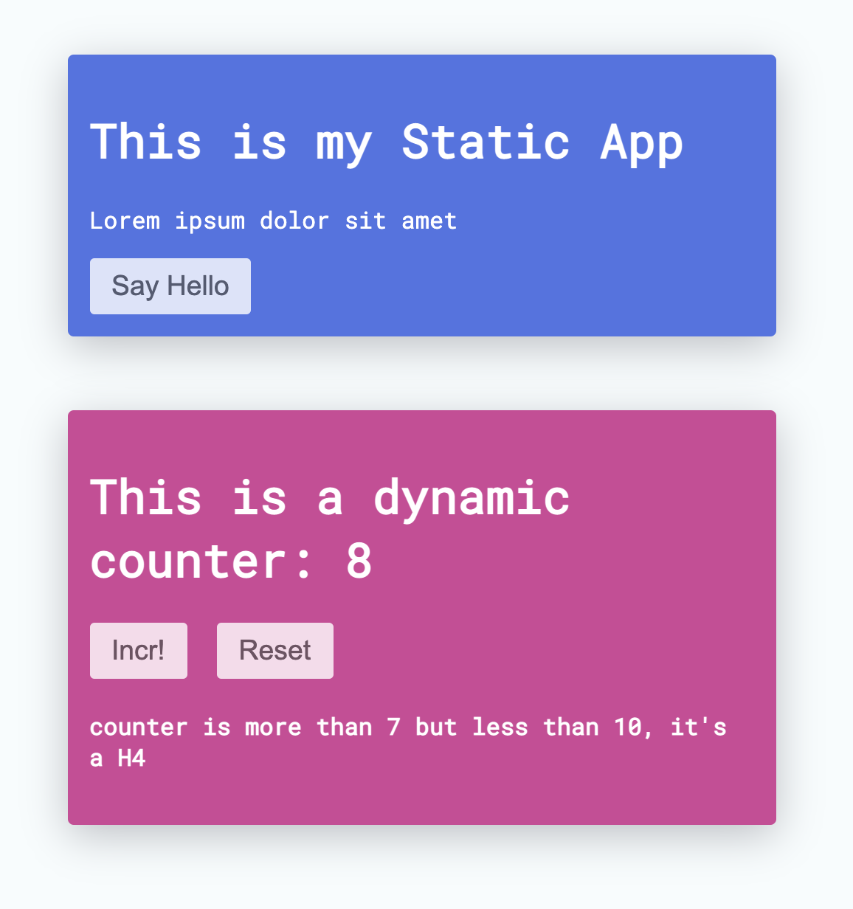

<p align="center">
  
<p>

## Why?

1. You will always learn much better when you Do-It-Yourself!
2. Fun
3. Provide a statement: **You Know React**

## What?
What you are having is...

- A tiny _React_, with 2 basic API: **createElement** & **RenderDOM**
- Create 2 **Apps**, one _static_ and one _dynamic_ (meaning it can update/delete)
- Using **RenderDOM** mount the 2 apps to two different nodes on the DOM
- The DOM tree after rendering would look like this:

```html
<body>
  <!-- Static, cannot update except printing things -->
  <div id="static-app">
    <div class="example-static-app">
      This is my Static App
      <h1 class="title">This is a heading</h1>
      <div class="inner-body">
        <p class="text">Lorem ipsum dolor sit amet</p>
        <button>Say Hello</button>
      </div>
    </div>
  </div>

  <!-- Fun part - a dynamic App that can update state & props & stuffs -->
  <div id="dynamic-app">
    <div class="example-dynamic-app">
      This is my Dynamic App
      <h1>This is a dynamic counter: 1</h1>
      <button>Incr!</button>
      <button>Reset counter!</button>
      <!-- if the Counter > 7, there will be a small hint shown bellow -->
      <!-- <h4>Counter > 7 and < 10 <h4> if counter > 7 and < 10 -->
      <!-- <h5>Counter more than 10 <h5> if counter >= 10 -->
    </div>
  </div>
</body>
```

## Architecture brief
To achieve the target mention above, the generall architecture of your React would consists of
- A VDOM is a tree of fiber-nodes
- Text-Node should be a fiber-node as well
- createElement should return a fiber-node
- after `setState`, render a new sub-tree of fiber-nodes and process to `diffing`
- `diffing` algorithm is a recursive run down both trees from the stateful root-node
- during `diffing`, *Tree-Swap* happen when a component's tag has changed, or when a component's children-structure changed
- when structure remains the same, but attributes change then only update the corresponding nodes

## Project status

- [x] Rendering works!
- [x] Updating works! (replacing tree or updating individual nodes)
- [x] Fiber reconciliation - not perfect, but generally it works.
- [x] JSX ready!
- [ ] Class Component Life-cycle Methods (reserved for studying)
- [ ] Better optimized `diffing` algorithm (reserved for studying)
- [ ] Hooks (reserved for studying)


## Learning instruction
- You can search in project for all `TODO` notes to know what needs to do to further enhance your **React**
- You can learn and try to implement `hooks` and `component-life-cycle method` (before-mount, did-update, memoize etc)
- Try to optimize `diffing` algorithm (ref to [official doc of React about `reconciliation`](https://reactjs.org/docs/reconciliation.html))
- Add more supported-events for your React


## Running

- clone the repo & cd into it
- `npm i` and `npm start`
- [local-hosted-App at :4444](http://localhost:4444)

## Screenshot

<p align="center">
  
<p>

Using this home-made React, you can write your app something like...

```javascript
const Button = (props: { onClick: EventHandler, text: string }) => {
  return <button onClick={props.onClick}>{props.text}</button>
}

const Heading = (props: { count: number }) => {
  const text = `This is a dynamic counter: ${props.count}`
  return <h1>{text}</h1>
}

const SubHeading = (props: { currentCount: number }) => {
  const { currentCount: cnt } = props

  if (cnt > 7 && cnt < 10) {
    return <h4>counter is more than 7 but less than 10, it's a H4</h4>
  }
  if (cnt >= 10) {
    return <h5>counter is more than 10, it's a H5</h5>
  }
}

class App extends React.Component {
  constructor(props: any) {
    super(props)
    this.state = {
      count: 1,
    }
  }

  handleOnClick = () => {
    this.setState({ count: this.state.count + 1 })
  }

  reset = () => {
    this.setState({ count: 0 })
  }

  render() {
    return (
      <div className="example-dynamic-app">
        <Heading count={this.state.count} />
        <Button text="Incr!" onClick={this.handleOnClick} />
        <Button text="Reset" onClick={this.reset} />
        {this.state.count > 7 && SubHeading({ currentCount: this.state.count })}
      </div>
    )
  }
}
```

And finally render it to a DOM node.

```typescript
React.RenderDOM(DynamicApp, "#container-id")
```
